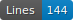

GT Celestine Doniau-Danest
==========================

    

## License

- CC-BY 4.0

## Description

Jeu de vérités de terrain pour la transcription automatique produit avec eScriptorium dans le cadre du cours HNU2000 à l'Université de Montréal au trimestre d'automne 2024. Le jeu de données contient 4 pages tirées aléatoirement des numérisation du "Journal de Célestine Doniau-Danest sur les débuts de la Guerre 1914-1918" mis en ligne par les Archives départementales de la Somme. 

*Ground Truth dataset for automatic text recognition created with eScriptorium during the HNU 2000 course at the Université de Montréal during the Fall 2024 semester. The dataset contains 4 pages taken randomly from the digitization of the "Journal de Célestine Doniau-Danest sur les débuts de la Guerre 1914-1918" (Diary of Célestine Doniau-Danest on the beginning of the 1914-1918 war), published by the departmental archives of Somme.*

## Extent

Le jeu de données ne présente qu'une seule main d'écriture, peu de variation, pour un texte écrit entre 1914 et 1915. Les numérisations sotn des doubles-pages.

## Annotation guidelines

Les règles de transcription appliquées pour la transcription du jeu de données ont été collégialement décidées durant le cours.

### Segmentation

Le vocabulaire contrôlé SegmOnto a été appliqué pour annoter la mise en page et typer les lignes de texte.

### Transcription

De manière générale, les règles de transcription suivies sont immitatives. 

- Mots illisibles: durant la phase de transcription, les mots illisibles ont été transcrits par \[???\]. Ils ont ensuite été résolus collectivement.
- Décoration du texte: les décorations comme le soulignage, etc, n'ont pas fait l'objet d'une transcription distincte du reste du texte.
- Correction et normalisation: les fautes d'orthographes ont été reproduites telles que dans la source, les espacements sont en revanche normalisés selon l'usage moderne.
- Ponctuation: 
    - pour la transcription des points (.) et des tirets (-), on a respecté le tracé dans la source plutôt que l'usage attendu car le tracé de ces deux signes est très distinct. 
    - les signes de ponctuation double (:;?!) ne sont pas précédé d'un espace.

## Sources

- Côte/Call Number: **134J94 (AD80, France)**
- Lien permanent/permalink: **[https://archives.somme.fr/ark:/58483/tjrd8pq42716](https://archives.somme.fr/ark:/58483/tjrd8pq42716)**
